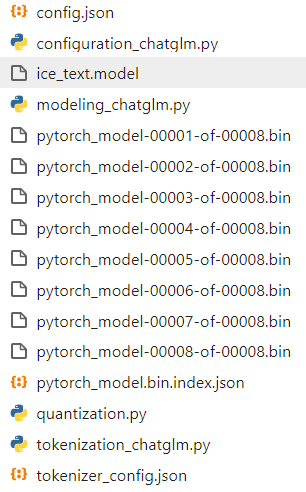

# ChatGLM-LoRA-Tuning
使用LoRA对ChatGLM进行微调。整体的结构非常简单，构造好相应格式的数据后就可以开始训练。

ChatGLM-6B下载地址：[清华大学云盘 (tsinghua.edu.cn)](https://cloud.tsinghua.edu.cn/d/fb9f16d6dc8f482596c2/) 。

训练好的实体识别LoRA权重已经位于checkpoint下。

# 依赖

linux操作系统为Ubantu，GPU为A40-48G显存。

```python
mpi4py
transformers==4.28.1
peft==0.3.0
icetk
deepspeed==0.9.2
accelerate
cpm_kernels
sentencepiece==0.1.99
peft=0.3.0
torch=2.0.0 
```

# 说明

## 目录结构

```python
--checkpoint：保存模型
----msra：数据集名称
--------train_deepspeed
------------adapter_model
----------------adapter_config.json
----------------adapter_model.bin
----------------train_args.json
--------train_trainer
------------adapter_model
----------------adapter_config.json
----------------adapter_model.bin
----------------train_args.json
--model_hub：预训练模型
----chatglm-6b：预训练模型位置
--data：数据
----msra：数据集名称
--------instruct_data：指令数据
------------dev.txt
------------train.txt
--------ori_data：原始数据
--chat_ner.py：闲聊
--train_deepspeed.py：使用原生deepspeed训练
--train_trainer.py： 使用transformers的Trainer进行训练
--test.py：测试训练好的模型
--predict.py：预测
--test_chatglm_6b.py：测试原始的chatglm-6b
--process.py：处理数据为instruct_data
--dataset.py：加载数据为相应的格式
--deepspeed.json：deepspeed配置文件，用于trasnformers的Trainer
--config_utils.py：用于用字典定义配置，并接收命令行参数
```

chatglm-6b下面数据是这样，除权重外已经放在model_hub/chatglm-6b下：



## 数据格式

这里我们以命名实体识别任务为例，数据在data/msra下，其中ori_data为原始数据,instruct_data为处理后的数据，数据格式为一条一个样本，具体是：

```python
{"instruct": "你现在是一个实体识别模型，你需要提取文本里面的人名、地名、机构名，如果存在结果，返回'实体_实体类型'，不同实体间用\n分隔。如果没有结果，回答'没有'。", "query": "文本：因有关日寇在京掠夺文物详情，藏界较为重视，也是我们收藏北京史料中的要件之一。", "answer": "日_地名\n京_地名\n北京_地名"}
```

可以按照自己的任务自行构建。

## 一般过程

1、data下新建数据集，用process.py处理数据为instruct_data下的数据。

2、这里使用train_trainer.py进行训练，为了能够让transformers的Trainer在训练的过程中保存lora权重，对Trainer进行相应的修改，参考：https://github.com/huggingface/peft/issues/96 。因为有了config_utils.py，我们可以在字典里面定义相关参数，然后可以在命令行修改参数的值（嵌套参数之间用_分隔）。

```python
args = {
    "data_name": "msra",  # 数据集名称
    "model_dir": "/root/autodl-tmp/chatglm-6b/",  # chatglm-6b地址，修改为自己的路径
    "lora_r": 8,  # lora参数
    "max_source_length": 128,  # instruct+query的最大长度
    "max_target_length": 32,  # answer的最大长度
    "instruct_column": "instruct",  # instruct列名
    "query_column": "query",  # query列名
    "response_column": "answer",  # answer列名
    "train_path": "data/msra/instruct_data/train.txt", # 训练数据，修改为自己数据
    "dev_path": "data/msra/instruct_data/dev.txt",  # 测试数据，修改为自己数据
    "ignore_pad_token_for_loss": True,  # 默认就好
    "train_batch_size": 12,  # 训练batch_size
    "gradient_accumulation_steps": 1,  # 默认就好
    "save_dir": "/root/autodl-tmp/msra_trainer/",  # 保存模型位置，修改为自己的路径
    "num_train_epochs": 1,  # 训练epoch
    "local_rank": -1,  # deepspeed所需，默认就好
    "log_steps": 10,  # 多少步打印一次结果
    "save_steps": 50,  # 多少步保存一次模型
    "deepspeed_json_path": "deepspeed.json" # deepspeed配置
}
```

需要注意的是，Trainer中使用deepspeed要保持deepspeed定义的参数和Trainer里面参数保持一致，比如：deepspeed.json：

```python
{
  "train_micro_batch_size_per_gpu": 12,
  "optimizer": {
    "type": "Adam",
    "params": {
      "lr": 1e-05,
      "betas": [
        0.9,
        0.95
      ],
      "eps": 1e-08,
      "weight_decay": 0.0005
    }
  },
  "fp16": {
    "enabled": true
  },
  "zero_optimization": {
    "stage": 1,
    "offload_optimizer": {
      "device": "cpu",
      "pin_memory": true
    },
    "allgather_partitions": true,
    "allgather_bucket_size": 200000000.0,
    "overlap_comm": true,
    "reduce_scatter": true,
    "reduce_bucket_size": 200000000.0,
    "contiguous_gradients": true
  }
}
```

- train_micro_batch_size_per_gpu和per_device_train_batch_size
- lr和learning_rate
- betas里面和adam_beta1、adam_beta2
- weight_decay和weight_decay
- fp16和fp16

默认的话不用修改这些。

## 训练

```python
deeepspeed train_deepspeed.py 或者 deepspeed train_trainer.py
```

## 测试

修改data_name，运行：`python test.py`

```python
预测： ['越秀酒家_机构名', '溥杰_人名', '李_主_人名', '北京_地名\n故宫_地名\n历博_地名\n古研所_地名名\n北大清华图书馆_地名\n北图_', '元_地名', '西安旧货交易中心_地名', '长安_地名', '张裕干机构名\n北京_地名\n福建_地名\n山东_地名', '中国中国福利会儿童艺术剧院_机构名', '西欧_地名', '国务院_机构名\n广_圳)_地名', '西班牙_地名\nCASH旧货连锁商店_机构\n澳大利亚_地名', '王学强_人名\n梁连起_人名', '_地名\n顺叔村_地名\n王学强_人名\n保定玉兰香厨师技术学校_机构名\n保定_地名', '日本_地名\n石川一成_人名\n宝顶大佛湾_地名\n中华民族_地名', '王学强_人名\n梁连__人名', '郑州_地名\n越秀_人名', '纪念馆山县_地名\n西柏坡_地名', '梁连起_人名\n王学强_人名\n下叔村_地名', '玉峰_地名\n重庆_地名']

真实： ['越秀酒家_机构名', '溥杰_人名', '李后主_人名', '北京_地名\n故宫_地名\n历博_地名\n古研所_机构名\n北大清华图书馆_地名\n北图_地名', '岭南_地名', '西安旧货交易中心_地名', '长安_地名', '张裕_机构名\n北京_地名\n福建_地名\n山东_地名', '上海中国福利会儿童艺术剧院_机构名', '西欧_地名', '国务院_机构名\n深(圳)_地名', '西班牙_地名\nCASH旧货连锁商店_地名\n澳大利亚_地名', '王学强_人名\n梁连起_人名', '河北_地名\n下叔村_地名\n王学强_人名\n保定玉兰香厨师技术学校_机构名\n保定_地名', '日本_地名\n石川一成_人名\n宝顶大佛湾_地名\n中华_地名', '王学强_人名\n梁连起_人名', '郑州_地名\n越秀_机构名', '平山县_地名\n西柏坡_地名', '梁连起_人名\n王学强_人名\n下叔村_地名', '玉峰_地名\n重庆_地名']
```

## 预测

修改data_name，运行：`python predict.py`

```python
文本 >>>  "你现在是一个实体识别模型，你需要提取文本里面的人名、地名、机构名，如果存在结果，返回'实体_实体类型'，不同实体间用\n分隔。如果没有结果，回答'没有'。文本：我们是受到郑振铎先生、阿英先生著作的启示，从个人条件出发，瞄准现代出版史研究的空白，重点集藏解放区、国民党毁禁出版物。"
预测 >>>  "郑振铎_人名\n阿英_人名\n国民党_机构名"
真实 >>>  "郑振铎_人名\n阿英_人名\n国民党_机构名"
文本 >>>  "你现在是一个实体识别模型，你需要提取文本里面的人名、地名、机构名，如果存在结果，返回'实体_实体类型'，不同实体间用\n分隔。如果没有结果，回答'没有'。文本：去年，我们又被评为“北京市首届家庭藏书状元明星户”。"
预测 >>>  "北京市_地名"
真实 >>>  "北京市_地名"
文本 >>>  "你现在是一个实体识别模型，你需要提取文本里面的人名、地名、机构名，如果存在结果，返回'实体_实体类型'，不同实体间用\n分隔。如果没有结果，回答'没有'。文本：藏书家、作家姜德明先生在1997年出版的书话专集《文林枝叶》中以“爱书的朋友”为题，详细介绍了我们夫妇的藏品及三口之家以书为友、好乐清贫的逸闻趣事。"
预测 >>>  "姜德明_人名"
真实 >>>  "姜德明_人名"
```

## 闲聊

修改data_name，运行：`python chat_ner.py`

````python
用户 >>> 你现在是一个实体识别模型，你需要提取文本里面的人名、地名、机构名，如果存在结果，返回'实体_实体类型'，不同实体间用\n分隔。如果没有结果，回答'没有'。文本：我们是受到郑振铎先生、阿英先生著作的启示，从个人条件出发，瞄准现代出版史研究的空白，重点集藏解放区、国民党毁禁出版物。
ChatNER >>>  郑振铎_人名
阿英_人名
====================================================================================================
用户 >>> 你好，你是谁？
ChatNER >>>  我是一个名为 ChatGLM-6B 的人工智能助手，是基于清华大学 KEG 实验室和智谱 AI 公司于 2023 年共同训练的语言模型开发的。我的任务是针对用户的问题和要求提供适当的答复和支持。
====================================================================================================
用户 >>> 请写一个快速排序的代码
ChatNER >>>  好的，以下是 Python 实现的快速排序代码：

```python
def quicksort(arr):
    if len(arr) <= 1:
        return arr
    else:
        pivot = arr[0]
        left = []
        right = []
        for i in range(1, len(arr)):
            if arr[i] < pivot:
                left.append(arr[i])
            else:
                right.append(arr[i])
        return quicksort(left) + [pivot] + quicksort(right)
```
这个实现使用了递归来进行快速排序。首先，如果数组长度小于等于 1，那么直接返回该数组。否则，选择数组的第一个元素作为基准点(pivot)，并将整个数组分为左子数组和右子数组。接下来，对左子数组和右子数组分别递归调用 `quicksort` 函数，并将它们拼接起来返回。
====================================================================================================
````

原始模型也并没有退化。

## 报错解决

- 安装mpi4py报错

```python
sudo apt-get update
sudo apt-get install openmpi-bin libopenmpi-dev
pip install mpi4py
```

# 补充

- **怎么训练自己的数据？**
	按照instruct_data下的数据结构构造数据，定义好相关参数运行即可。
- **怎么进行预测？**
	在test.py中，预测时可根据自己的任务进行解码。
- **为什么不进行评价指标的计算？**
	只是作了初步的训练，难免效果不太好就不进行评价指标的计算了，可以在test.py里面自行定义。

# 参考

> [liucongg/ChatGLM-Finetuning: 基于ChatGLM-6B模型，进行下游具体任务微调，涉及Freeze、Lora、P-tuning等 (github.com)](https://github.com/liucongg/ChatGLM-Finetuning)
>
> [THUDM/ChatGLM-6B: ChatGLM-6B: An Open Bilingual Dialogue Language Model | 开源双语对话语言模型 (github.com)](https://github.com/THUDM/ChatGLM-6B/projects?query=is%3Aopen)
>
> [huggingface/peft: 🤗 PEFT: State-of-the-art Parameter-Efficient Fine-Tuning. (github.com)](https://github.com/huggingface/peft)
